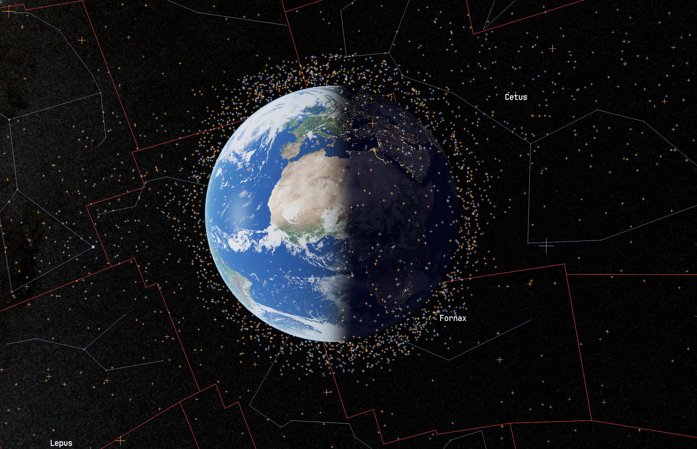
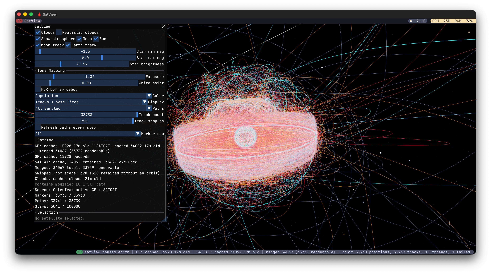
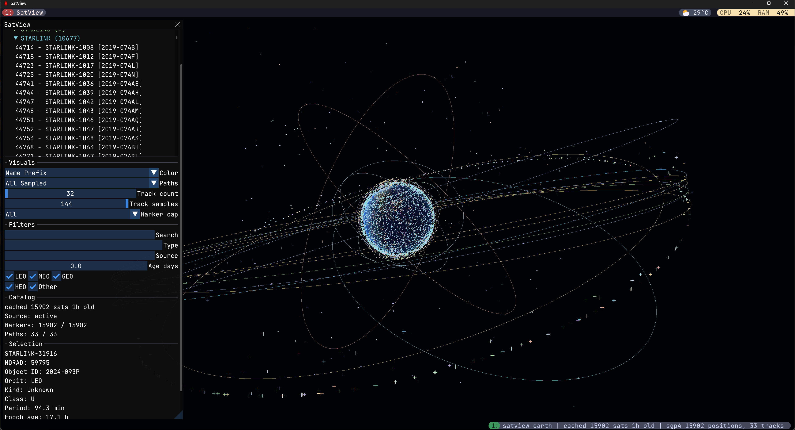
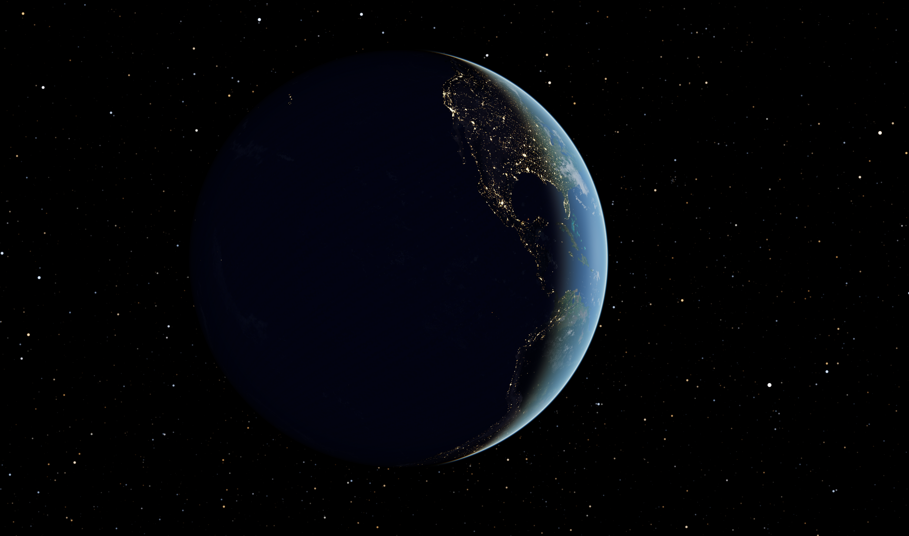

# SatView

SatView is a satellite and sky visualization plugin for
[Draxul](https://github.com/cmaughan/Draxul), a cross-platform GPU terminal and
agentic shell host. It renders an interactive 3D Earth globe, a full-screen 2D
equirectangular map, and ground-observer sky views, populated with the live
CelesTrak satellite catalog propagated by SGP4, a Hipparcos starfield with
constellation overlays, an ephemeris-driven Moon, Sun, and planets, and a
ray-marched atmosphere. It is loaded into Draxul at runtime as the dynamic
module `dev.draxul.satview` over Draxul's versioned C plugin ABI, rendering
through Vulkan on Windows and Metal on macOS.



```text
draxul tab create --space <space-id> --name SatView --plugin dev.draxul.satview --json
```

The full product narrative lives in [docs/satview.md](docs/satview.md).

## Gallery

_Click any image to view full size._

<table>
<tr>
<td align="center"><a href="screenshots/tracks.png"></a><br><em>Orbit tracks for the full 33,000-object merged catalog</em></td>
<td align="center"><a href="screenshots/starlink.png"></a><br><em>Starlink constellation in the catalog tree (Windows)</em></td>
</tr>
<tr>
<td align="center"><a href="screenshots/projection.png"></a><br><em>Pannable 2D map projection with the live catalog (Windows)</em></td>
<td align="center"><a href="screenshots/mars.png"></a><br><em>Phobos POV over Mars (Windows)</em></td>
</tr>
<tr>
<td align="center"><a href="screenshots/earth.png"></a><br><em>Earth's night side with city lights</em></td>
<td></td>
</tr>
</table>

## Facilities

### Views and projections

- Switchable interactive 3D globe, full-screen 2D equirectangular map with a
  pannable center longitude/latitude, and Earth ground-observer sky view
  entered by double-clicking the globe or map.
- Ground view places the camera just above the selected WGS-84 surface point
  and defaults to a conformal stereographic projection (up to 235 degrees),
  with a conventional perspective projection (up to 120 degrees) as an
  alternative. Its quaternion camera crosses zenith and nadir without a pitch
  clamp.
- A hierarchical POV dropdown covers the Sun, all eight planets, and 20 major
  moons. Earth and the Moon keep precision catalog paths; other bodies use
  normalized body-centric views with source-based radii, oblateness, spin, and
  local mean-element orbit guides. The Sun view zooms from its surface out
  through per-planet orbit-track checkboxes for all eight planetary orbits.

### Catalogs and propagation

- Independently cached CelesTrak feeds: the `active` GP JSON element set and
  the full SATCAT CSV, merged by NORAD id, with two-hour and twelve-hour
  freshness guards and last-good fallback so one failed source never discards
  the other. Offline startup merges both caches, falling back to a bundled
  synthetic sample only when neither is usable.
- Precise SGP4 propagation (the pinned Vallado/CelesTrak AIAA-2006-6753
  reference implementation) for active GP records. SATCAT-only records use a
  deterministic summary solver and are clearly labeled
  `SATCAT summary estimate`; rows without enough orbital state remain
  selectable as non-rendered `Catalog only` entries.
- Population coloring and filtering for active payloads, inactive payloads,
  rocket bodies, debris, and unknown objects, plus LEO/MEO/GEO/HEO classes and
  a derived sun-synchronous candidate filter with a dawn/dusk terminator
  split.
- A generated offline lunar ephemeris (NASA/JPL Horizons and NASA SSC sources)
  upgrades six lunar missions to sampled Moon-relative trajectories with
  cubic Hermite interpolation and strict validity bounds.
- Bundled offline surface catalogs: 70 LROC-confirmed lunar surface objects
  grouped into 46 mission sites, and nine historical Mars landing sites, with
  per-object provenance and a primary-source-backed lunar disposition overlay.

### Celestial rendering

- Linear RGBA16F HDR pipeline with adaptive 4x/2x/1x MSAA fallback, ACES tone
  mapping, and persisted exposure and white-point controls, on both Vulkan and
  Metal.
- Date-aware day/night Earth lighting from 8k day and night maps, an elevated
  cloud shell using a bundled texture by default with an optional
  asynchronously cached near-real-time source, and a ray-marched Rayleigh/Mie
  atmosphere with planet shadow and depth-aware composition.
- Real-scale ephemeris Moon (8k NASA LRO mosaic, tidally locked orientation,
  phase-dependent Earthshine, analytical orbit track) and a real-scale
  rotating emissive Sun (4k texture, limb darkening, IAU axis orientation).
- Hipparcos starfield of the 100,000 brightest usable records rendered as
  additive instanced tiny quads with a persisted apparent-magnitude window,
  optional constellation figures, official IAU boundaries, ranked
  constellation labels, and an oriented 4k NASA Milky Way background.
- Layered Saturn rings, textured planet and major-moon bodies, and a
  reversed-Z float depth buffer that keeps interplanetary distances stable
  without proxy geometry.
- A procedural observatory horizon silhouette with cardinal-direction labels
  in ground view.

### Interaction and controls

- Smoothed quaternion left-drag orbit, Ctrl+drag and mouse-wheel dolly, and
  keyboard orbit/dolly (`W/A/S/D`, arrows, `Q/E`, `T/G`, `R/F`).
- Click and tree selection with picking that matches the projection math on
  CPU and GPU; double-click enters ground view or switches body POV.
- `Home` resets the camera, `Ctrl+R` refreshes catalog data, `F1` toggles the
  panels, and `Space`, `[`, and `]` control simulation time. A `Real Time`
  action restores the current system time at `1x`.

### Panels and persistence

- Six dockable ImGui panels: `Scene` (owns the GPU render viewport), `View`,
  `Rendering`, `Filter` (separate `Orbits` and `Surface` tabs), `Selection`,
  and `About`, rearrangeable through normal ImGui docking.
- View, rendering, filter, and overlay settings — star magnitude limits,
  brightness, line widths, marker scale, visibility toggles, projections, and
  more — persist across sessions.

## Building as part of Draxul

SatView is not currently a standalone build; it builds inside a Draxul
checkout, where it is mounted as a git submodule at `plugins/satview`:

```bash
git clone --recurse-submodules https://github.com/cmaughan/Draxul
# or, in an existing checkout:
git submodule update --init
```

The plugin is gated by the Draxul CMake option `DRAXUL_ENABLE_SATVIEW`
(default `ON`). The mount path can be overridden with the
`DRAXUL_SATVIEW_PLUGIN_DIR` cache variable to point at an out-of-tree checkout
of this repository. When enabled, the plugin, its shaders (GLSL compiled to
SPIR-V via glslc on Windows, Metal compiled to a metallib via xcrun on macOS),
and its `assets/` directory build and stage automatically with the `draxul`
target — no separate build step is needed.

The plugin may link only Draxul's public Plugin SDK (`Draxul::PluginSDK`) and
a small allowlist of generic `Draxul::PluginSupport::*` static support
libraries; Draxul enforces this at configure time.

## Data sources and attribution

[docs/data-sources.md](docs/data-sources.md) is the full ledger of every data
source: live runtime feeds and their caches, generated offline assets and
their regeneration tools, and static textures, each with provenance, update
cadence, and fidelity notes. In brief: orbital data comes from CelesTrak (GP
and SATCAT feeds), lunar trajectories from NASA/JPL Horizons and the NASA
Satellite Situation Center, stars from the Hipparcos catalog via CDS VizieR,
and imagery from NASA (LRO, SVS) and Solar System Scope. Detailed licensing
and image credits live in [assets/README.md](assets/README.md) and the
attribution files beside each generated asset.

## Layout

| Path | Contents |
|---|---|
| `product/` | Public headers for the SatView product libraries (core, scene, services, renderer, runtime) |
| `src/` | Library sources and the `dev.draxul.satview` plugin module entry points (Vulkan and Metal) |
| `assets/` | Bundled textures and generated catalogs, with attribution files |
| `shaders/` | GLSL and Metal shader sources |
| `tests/` | C++ test suite and a Python catalog test |
| `tools/` | Offline generators for star, constellation, ephemeris, and texture assets |
| `docs/` | Product narrative ([satview.md](docs/satview.md)) and data-source ledger ([data-sources.md](docs/data-sources.md)) |
| `plans/` | Design documents and research notes |
| `cmake/` | Pinned dependency fetching and test registration |

## Testing

Tests live in `tests/` and are registered into Draxul's ctest suite when the
plugin is enabled: the C++ tests build into a `draxul-test-satview` binary run
as two ctest shards, and `satview_catalog_py_tests.py` runs as a Python
unittest. All carry the `satview` label, so from a configured Draxul build:

```bash
cmake --build build --target draxul-tests
ctest --test-dir build -L satview --output-on-failure
```

On Windows, add `--build-config Release` (or the configuration you built).

## Relationship to Draxul

The dependency direction is strictly one-way: SatView links against Draxul's
Plugin SDK and the allowlisted `Draxul::PluginSupport::*` libraries, and
Draxul links nothing of SatView — the versioned C plugin ABI is the only
runtime boundary between the host and the module. This repository was split
out of the Draxul monorepo; the deep pre-split history of these files remains
in the [Draxul](https://github.com/cmaughan/Draxul) repository.
